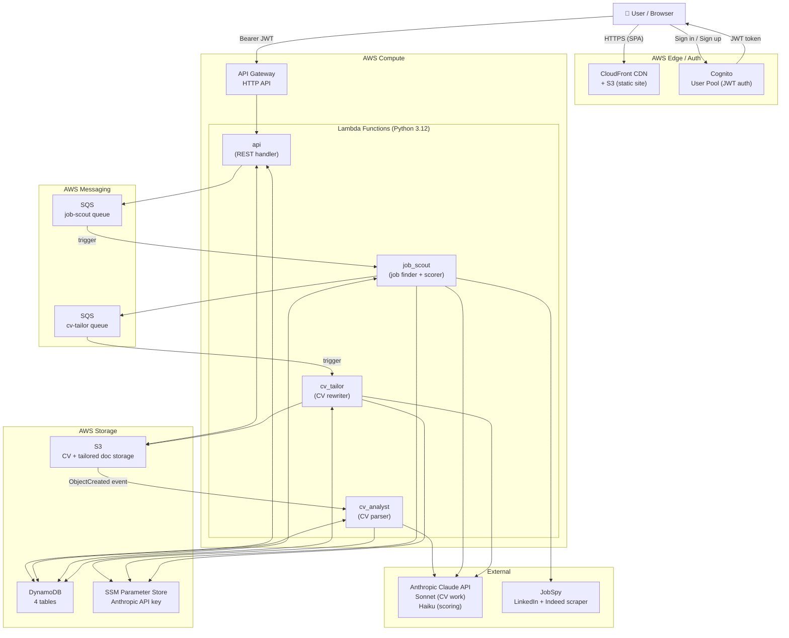
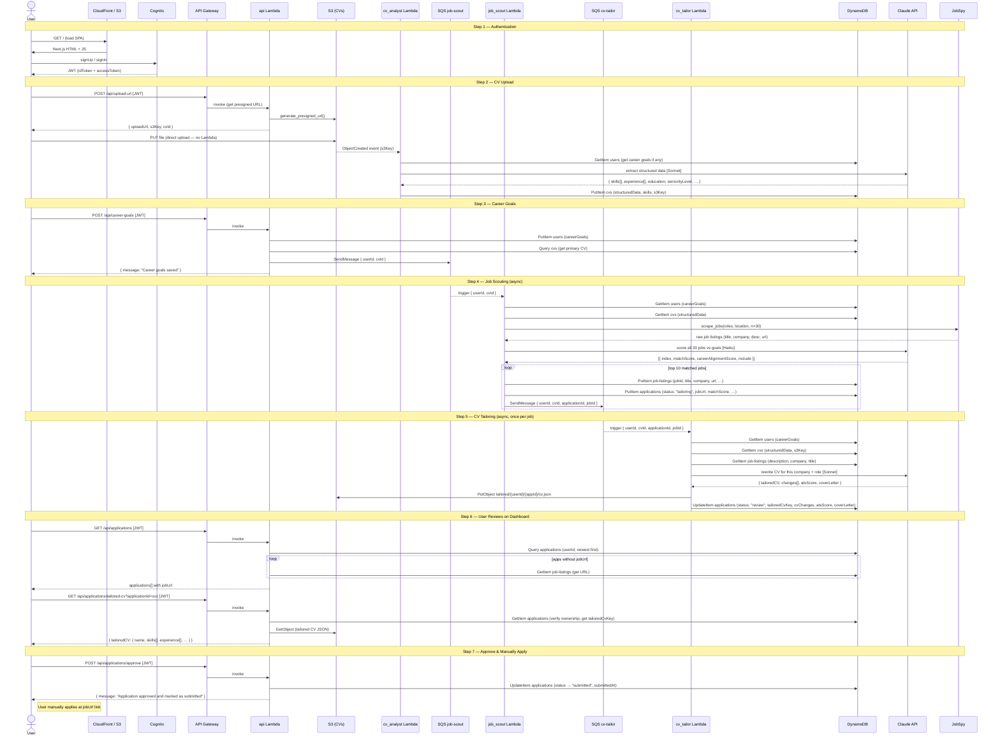

# AIApply — Architecture Diagrams

---

## Diagram 1: High-Level Architecture

---

## Diagram 2: Detailed Service-Call Flow

---

## Data Flow Summary

| Step | Trigger | Lambda | Reads from | Writes to |
|------|---------|--------|-----------|-----------|
| CV Upload | S3 ObjectCreated | `cv_analyst` | SSM (API key) | DynamoDB cvs |
| Career Goals | API call (user) | `api` | DynamoDB cvs | DynamoDB users + SQS job-scout |
| Job Scouting | SQS job-scout | `job_scout` | DynamoDB users+cvs, JobSpy, SSM | DynamoDB job-listings+applications, SQS cv-tailor |
| CV Tailoring | SQS cv-tailor | `cv_tailor` | DynamoDB users+cvs+jobs, SSM | S3 (tailored CV), DynamoDB applications |
| Get Applications | API call (user) | `api` | DynamoDB applications+jobs | — |
| Get Tailored CV | API call (user) | `api` | DynamoDB applications, S3 | — |
| Approve | API call (user) | `api` | — | DynamoDB applications |
